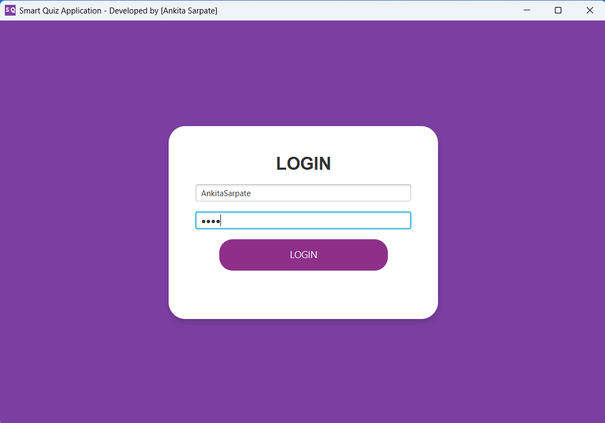
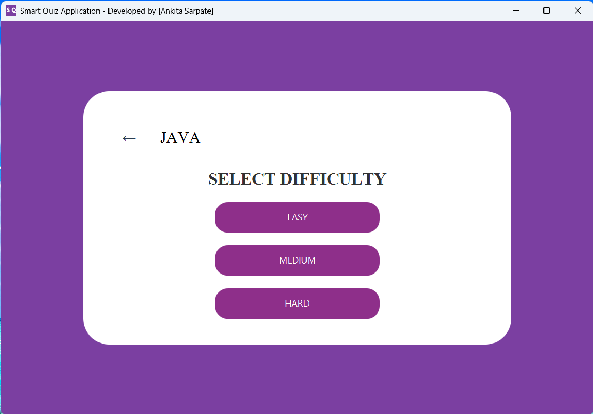

# Smart Quiz Application

An offline desktop-based quiz application developed using Core Java, JavaFX, and SQLite.

## Features

- Subject-based quizzes
- Easy, Medium, and Hard difficulty levels
- Timer-based questions
- Automatic score calculation
- Progress tracking
- Leaderboard system
- SQLite database integration

## Technologies Used

- Core Java
- JavaFX
- SQLite

## Screenshots

## Author

Ankita Sarpate
